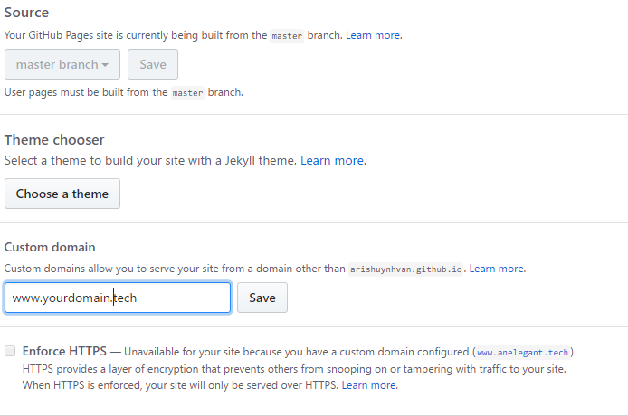

## Motivation

So it's quite obvious that I gave up on the previous iteration of 100 days of code (which started in Jan 2017).
Yet, I don't want to give up this training, so I'll try again

## Structured programs to follow

30 days, 30 sites - [techwithtris]()

[30daysofjavascript]() - wesbos

[dailyUI]()

[freecodecamp]()

## Side projects

Charchawale for [makerwala.in](http://makerwala.in/)

## Day 1

### What I've achieved

- I revamped my [about page in codepen]() by following the [bootstrap tutorial on w3school for company]()
- I also set up my own free domain with .tech using my student (.edu) email. It's free for a year, so it's good enough for me to use now

### What's next?

- Update the form & buttons in my about page for collecting real email addresses & send clients' emails to me
- Update my website titles for this repo (new title: T.An Elegant Tech)
- Major revamp for the structure of this site
- Post my portfolio on FB (in the far future when my other sites of portfolio are more ready)

### Learning points

- "vw" (viewport width) units for scaling with page width
- Adding Google map to my site
- Splitting rows for responsive display of big & smal screen sizes
- How to set up free email with my free domain & direct it to my gmail account
- How to link my domain to Github pages
- How to get a [free .edu email]()

#### More on how to link my free .tech domain with Github pages

Adapted from [Namecheap article](https://www.namecheap.com/support/knowledgebase/article.aspx/9645/2208/how-do-i-link-my-domain-to-github-pages)

1. Go to settings 

2. Scroll down to GitHub Pages section
3. Type in custom domain in the Custom domain textbox and hit Save (remember the "www")

After this step, usually Gihub will automatically add/modify CNAME file to the root of Github repo. Check if this CNAME exists. Then, check if the first line is the custom domain.

4. Sign into the control panel of the custom domain with username & password
5. Find the setting for managing DNS (it can be "Manage DNS" or "Advanced DNS")
6. Add a CName record with "www" as the host and your "username.github.io" (where this username is github username) as the value. Save this record.
7. Now launch the site at the custom domain to test if GitHub page has been properly linked with the custom domain
